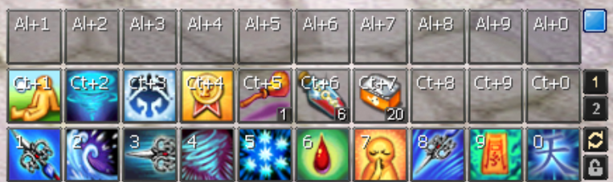

# NosTale dot files

This project contains two files:
* skills.png - my actuall skill setup - I use it three years.
* run.sh - useful script for Wine (linux winapi wrapper) workaround since gameforge launcher does not launch the game.
Also fixes not rendered properly Fonts.
#### You can also use path for wine like that:
`wine NostaleClientX.exe EntwellNostaleClient`

Or

`wine NostaleClientX EntwellNostaleClient`

Since Windows (thus wine too) can run programs without using `.exe` extension in shell/console.
